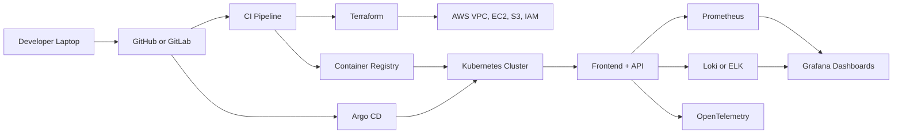

# CloudOps Microservices Platform

A runnable DevOps portfolio project with a real app and production-style platform tooling.

The app is a small task tracker:

- Frontend: static HTML, CSS, JavaScript served by Nginx
- Backend: Python FastAPI
- Database: PostgreSQL
- Metrics: Prometheus endpoint at `/metrics`
- Local platform: Docker Compose
- Dashboards: Grafana with Prometheus and Loki data sources
- CI/CD: GitHub Actions, GitLab CI, and Jenkins examples
- Cloud: Terraform AWS EC2 starter
- Config management: Ansible Docker host setup
- Orchestration: Kubernetes manifests
- GitOps: Argo CD application manifest

This is intentionally simple as an application and serious as a DevOps project. That is exactly what you want for interviews: you can explain the platform without getting lost in product code.

## Run Locally

Install Docker Desktop or Docker Engine first.

```bash
cp .env.example .env
docker compose up --build
```

On Windows PowerShell:

```powershell
.\scripts\start-local.ps1
```

Open:

- Frontend: http://localhost:8080
- Backend API docs: http://localhost:8000/docs
- Health check: http://localhost:8000/health
- Metrics: http://localhost:8000/metrics
- Prometheus: http://localhost:9090
- Grafana: http://localhost:3000

Grafana login:

- User: `admin`
- Password: `admin`

Stop everything:

```bash
docker compose down
```

Remove database and Grafana volumes:

```bash
docker compose down -v
```

## Run Backend Tests

```bash
cd app/backend
pip install -r requirements.txt
pytest
```

## Repository Layout

```text
app/
  backend/        FastAPI API, tests, Dockerfile
  frontend/       Nginx static frontend, Dockerfile
infra/
  ansible/        EC2 Docker host setup
  terraform/      AWS VPC, subnet, security group, EC2
k8s/
  base/           Kubernetes manifests
gitops/
  argocd/         Argo CD application
observability/
  prometheus/     Prometheus scrape config
  grafana/        Grafana data source provisioning
docs/             Learning roadmap and interview documentation
```

## What Works Now

- Create, list, update, and delete tasks
- PostgreSQL persistence through Docker Compose
- Backend health check
- Prometheus metrics endpoint
- Prometheus scraping backend metrics
- Grafana starts with Prometheus and Loki data sources
- CI examples can test and build images
- Kubernetes manifests can deploy the app after images are available
- Terraform can create a basic AWS EC2 environment
- Ansible can install Docker on an Ubuntu EC2 host

## Architecture



## What Recruiters Should See

Your final GitHub repository should show:

- Clean `README.md`
- Architecture diagram
- Local setup instructions
- CI/CD pipeline
- Dockerfile and Docker Compose
- Terraform modules
- Ansible playbooks
- Kubernetes manifests or Helm chart
- Argo CD application definition
- Monitoring dashboards
- Logging setup
- Security notes
- Troubleshooting guide
- Screenshots of running app, pipeline, Grafana dashboard, Argo CD sync, and AWS resources

## Build Phases

1. Linux and local app foundation
2. Git and repository workflow
3. Docker and Docker Compose
4. CI pipeline
5. AWS infrastructure with Terraform
6. Configuration management with Ansible
7. Kubernetes deployment
8. GitOps with Argo CD
9. Monitoring, logging, and tracing
10. Security hardening and documentation

## Portfolio Pitch

Use this summary on your resume:

> Built an end-to-end DevOps platform for a containerized microservice application using Docker, Kubernetes, Terraform, Ansible, GitHub Actions, Argo CD, Prometheus, Grafana, Loki, and AWS. Automated infrastructure provisioning, CI/CD delivery, GitOps deployments, observability, and security controls across development and production-style environments.

## Start Here

Read [docs/01-roadmap.md](docs/01-roadmap.md), then complete the phases one by one. Do not rush to Kubernetes before Docker Compose works locally.
